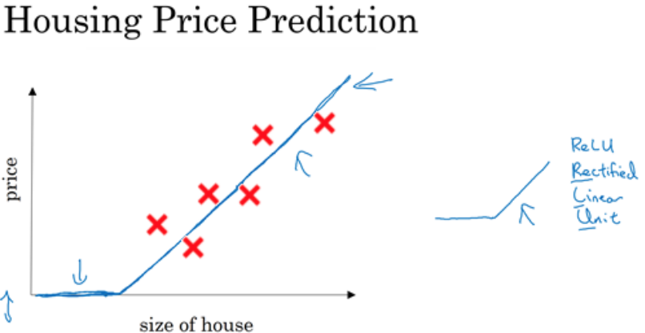
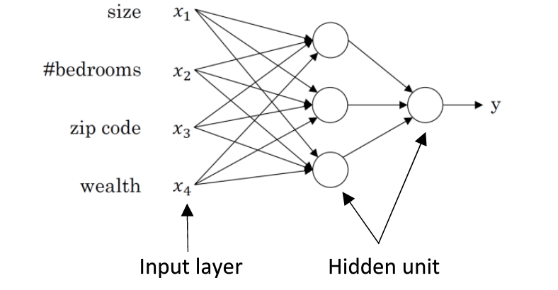
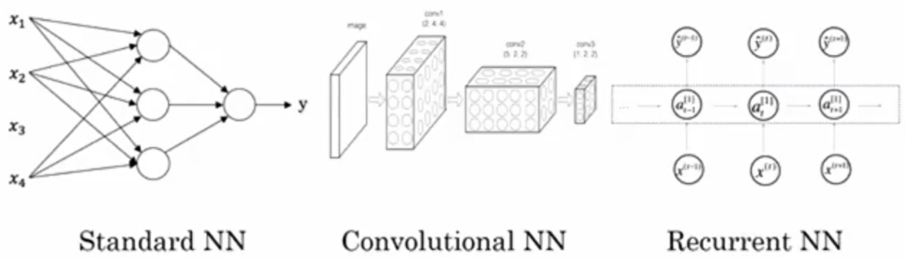

### 1.1、AI介绍
AI(Artificial Intelligence)人工智能变革了无数行业：交通业，制造业，医疗健康，通讯业等。
课程涵盖内容：
- 神经网络和深度学习
- 改善深层神经网络：超参数调试、正则化以及优化
- 构建机器学习项目
- 卷积神经网络
- 自然语言处理：构建序列模型

### 1.2、什么是神经网络
深度学习是对**神经网络**进行训练。

例子：Housing price Predition(房屋面积与房价的关系)
- 输入: 房屋面积
- 输出: 房价
- 神经元: 中间计算方程（节点），作用：根据输入，利用模型进行计算，并得到输出结果；大的神经网络，有很多个计算神经元堆叠起来。

上图方程为ReLU(rectified linear unit)：修正线性单元

复杂的神经网络例子：
- 多个输入特征：size、bedroom nums,
- 隐藏单元：多层的计算单元

### 1.3、监督学习（supervised learning）

输入：Input --推算-->   输出：Output

Input | Output | Application
-   | :-: | -:
房屋特征|房价|地产评估
广告，用户信息  | 哪些用户会点击广告（0/1）  | 个性化广告推荐
图像  | 类别（0....1000）  | 照片标签
声音  | 文字  | 语音识别
英文  | 中文  | 机器翻译
图片，雷达信息  | 周围车辆信息  | 无人驾驶

神经网络例子：
- 标准神经网络
- 卷积神经网络(Convolutional NN)：图像识别
- 循环神经网络(Recurrent NN)：一维序列数据

数据集分类
- 结构化数据集：数据库，列表数据，每个特征(ex:房屋面积、数量)都是可度量的
- 非机构化数据集：音频，图片，文本，基于深度神经网络，计算机能更好理解非结构化数据
