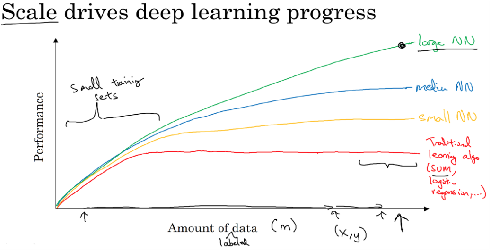
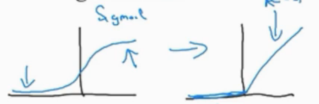
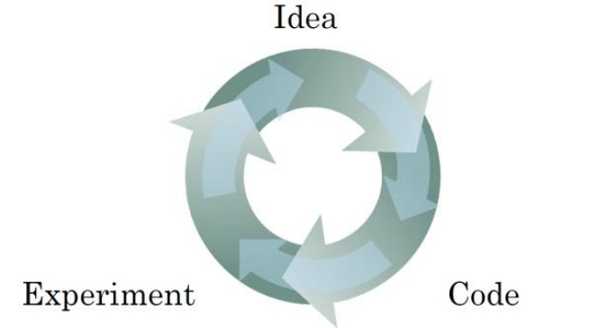

### 1.4、为什么机器学习兴起
大数据量的计算驱动机器学习的兴起，海量数据电子化。收集大数据越来越简单。对于大数据量，有一个趋势：神经网络的深度越深（层数越多）则最后的结果会显著增强。

Scala(大规模)驱动深度学习
- 更深、更大的神经网络模型
- 海量的标记数据:知道数据的标记（即：x对应的y）

从图中可看出：当数据量较少时，Performance跟模式的设计有关，更深层的深度学习并不能优于简单的SVM(支持向量机分类)。而只有大数量才能真正现实深度神经网络的价值。

三个重要因素
- Data：标记数据
- Computation：计算能力，CPU、GPU、分布式集群
- Algorithms：算法的创新，让神经网络运行更快

例子：sigmoid（梯度接近0时，计算很慢）---> ReLU(激活函数)

计算、算法的优化推进了神经网络加速训练、测试，良性循环。

### 1.5、关于这门课
- 入门介绍
- 神经网络基础（涉及编程）
- 单层神经网络
- 深度神经网络（多层）

### 1.6、参考资料
中文文档：http://www.ai-start.com  
课后练习：https://github.com/andersy005/deep-learning-specialization-coursera

### 1.7、课后练习
