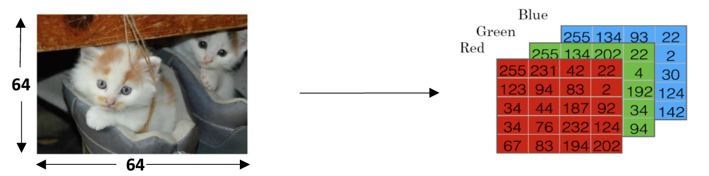
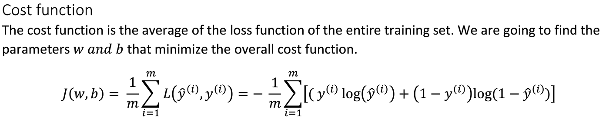
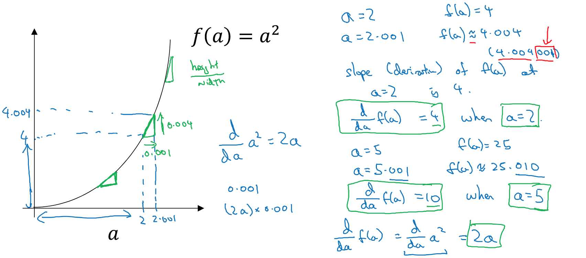

### 2.1、二分分类
构建神经网络，有些技巧会相对重要。例如：对于m个样本的训练集，可能会习惯性使用for循环对每个样本进行遍历操作。但在神经网络中，如果要遍历训练样本会避免使用使用for循环。学习神经网络为什么会分为**前向传播**(forward propagation)、**反向传播**(backforward propagation)两个分开的过程。

logistic回归是用于二分类的算法，二分类例子：(0 vs 1)

有一张图片作为输入，需要识别出该图片的标签，识别是猫，则为1；识别不是猫，则为0。使用y作为输出的结果标签。在计算机中，会通过**独立的三个矩阵**(RGB)来表示图片的三颜色通道。如果图片的像素是64x64，那么会对应3个64x64的矩阵。

将像素亮度值(pixel intensity value)放进一个特征向量中，即是把这些像素值提取出来，放入一个特征向量x (feature vector x)。定义一个如下的特征向量x来表示对应的图片，将所有的像素值都提取出来，这样我们得到的特征向量会非常长。对于64x64的图片，其特征向量的长度是64x64x3=12288。用Xn=12288表示，代表特征向量的维度。

二分类问题的目标是训练出一个分类器，将图片的特征向量x作为输入，预测出图片的标签结果(0|1)。

**符号说明(Notation)**
- （x, y)： x是n维的特征向量，标签y是0或1；训练数据集用右上角角标区别；
-  用小写m代表训练样本的个数；
-  用一个m列的矩阵X来代表m个训练集的特征向量，矩阵的高度(行)是n。
-  结果集Y常放于一个列向量中，y1, y2....，分别对应x1, x2....特征向量的标签结果

### 2.2、logistic回归
对于已知的输入特征向量x（ex：一张猫的图片），需要一个算法用来获取预测值y^，y^是对y的一个预测值，y^= P(y=1|x)，基于y^识别出该图是猫的概率，因此希望y^介于0~1之间，因此引入sigmoid函数。使用logistic function 目标是计算出w和b，使得y^得到更好的估计值。

**Notation**
对神经网络进行编程时，通常会把w和参数b分开，其中b对应一个拦截器(interceptor)。另外的表示方法，将x0=1，x是n+1维的，如上图红框表示。

### 2.3、logistic回归损失函数
为训练出w和b，需要定义logistic回归的成本函数(损失函数)。通过m个训练集，找到参数w和b，使用上角标i来表示对应i训练样本的相关参数和标记结果。

损失函数:尽量使用**凸函数**(convex function)，便于找到全局最优值。所以不适用平方误差作为损失函数(会出现局部最优的),损失函数L是用来衡量预测输出值y^和实际值y有多接近。

成本函数:对m个样本的损失函数求均值。

因此：为获取合适的w和b，即使最小化成本函数J(cost function)。

**备注：** 对数函数

### 2.4、梯度下降法
损失函数是衡量单一样本的训练效果，成本函数用于衡量参数w和b的效果(performance)。使用**梯度下降法**来训练或学习训练集上的w和b参数。

**目标**：寻找w和b，使得成本函数J(w,b)尽可能最小化。保证成本函数是凸函数(convex function)。

为找到最小化的J，先任意初始化w和b，对于logistic，几乎所有的初始化都是有效的，常用0进行初始化。

**梯度下降法：** 从初始点开始，朝向最陡的下坡方向走（梯度最快下降的方向），最后得到全局最优值，或接近全局最优值。**基于学习率α、导数重复更新w的值**。 dJ/dw(**偏导数**)是基于w的斜率，是下降速度最快的方向。

使用**内循环**，基于w:=w-α(dJ/dw)来更新w，基于b:=b-α(dJ/db)来更新b。

### 2.5、导数
导数(斜率)：函数y基于参数x的**变化率**。函数的斜率可能在不同点事不同的。

### 2.6、导数例子
非线性函数的导数：

其他例子：

