### 2.7、计算图
一个神经网络的计算都是按照前向或者反向传播的过程实现的，首先计算出神经网络的输出，紧接着利用反向传输操作，计算出对应的梯度(导数)。**计算图**解释为什么使用这样的步骤进行操作。

例子：
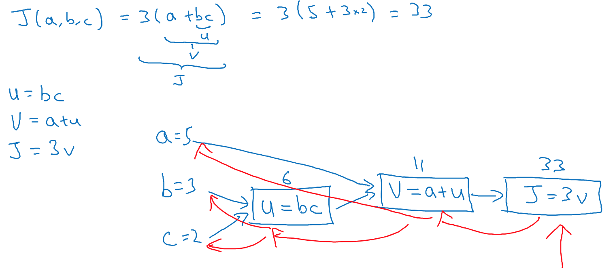
计算图：有不同的，或者一些的特殊的输出变量时，如需要优化的成本函数J，可以通过从左到右的过程(前向过程)计算输出结果，而从右到左的过程(反向过程)更便于计算导数。

**总结：** 计算图是蓝色箭头画出的，从左到右的计算。

### 2.8、计算图导数计算
计算下面J函数的导数的流程图，偏导数求解，传播性。展示如何计算dJ/dv, dJ/da。
计算
```
dv=dJ/dv=3
da=dJ/da=(dJ/dv)x(dv/a)=3x1=3
```
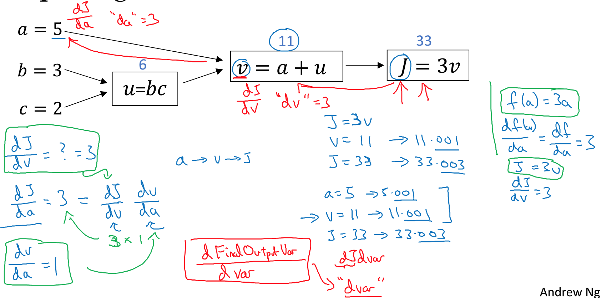

当使用反向传播，通常会有一个最终输出值是你所关心的。如上面例子，最终的输出值是J函数所得。很多计算都尝试获得输出变量的导数，在程序是可以对于dFinalOutputVar/dvar可以简写成dvar，表示你关心的最终变量如J关于var的导数。ex: dv=dJ/dv，da=dJ/da。

计算
```
du=dJ/du=(dJ/dv)x(dv/du)=3x1=3
db=dJ/db=(dJ/du)x(du/db)=3xc=3c=6
dc=dJ/dc=(dJ/du)x(du/dc)=3xc=3b=9
```
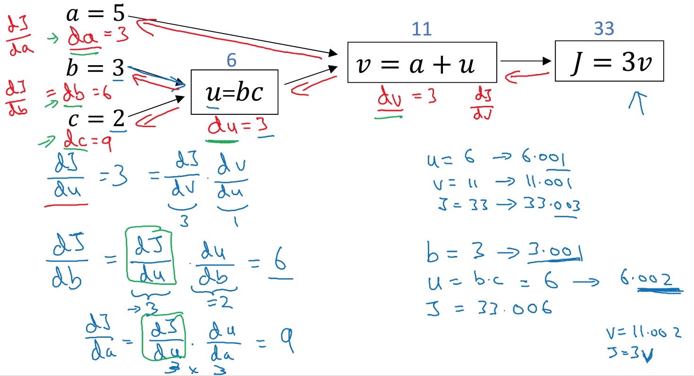

### 2.9、logistic回归的梯度下降
**主题：** 如何通过偏导数求解来实现logistic回归的梯度下降法，基于计算图讲解。

假设对一个样本进行计算，该样本有两个特征x1, x2，引入三个参数w1,w2,b来计算z,目标：最小化L损失函数。
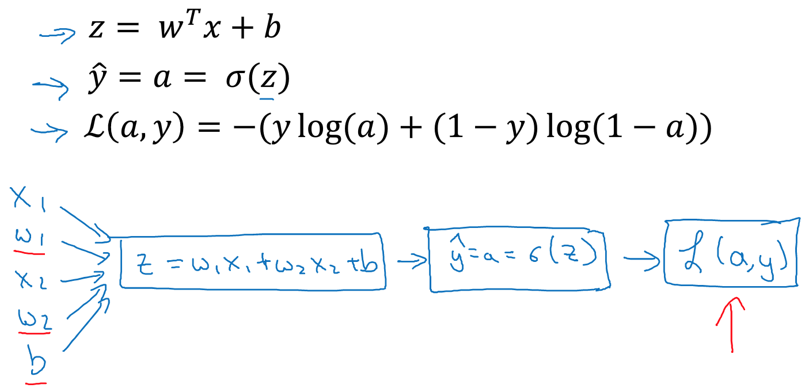
```
da=dL/da = -y/a + (1-y)/(1-a）
dz=dL/dz = dL/da x da/dz = (-y/a + (1-y)/(1-a))) x a(1-a) = a-y
dw1=dL/dw1=dL/dz x dz/dw1=x1dz=x1(a-y)
dw2=dL/dw2=dL/dz x dz/dw2=x2dz=x2(a-y)
db=dL/dw1=dL/dz x dz/db=dz
```
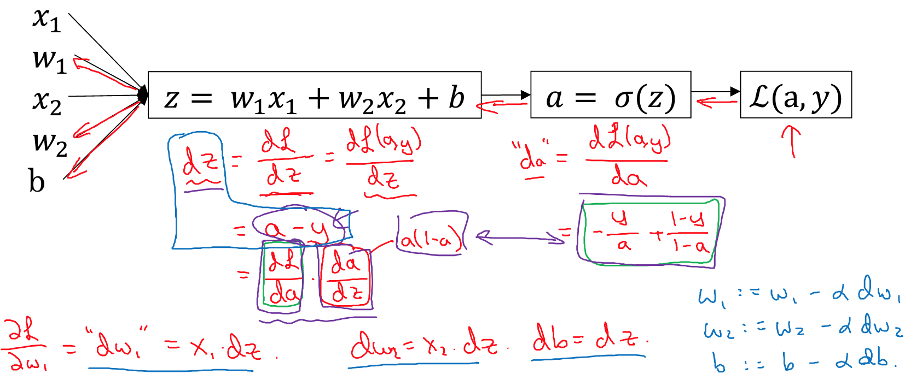

### 2.10、M个样本的梯度下降
最优化成本函数J，其中i角标对应对i个样本
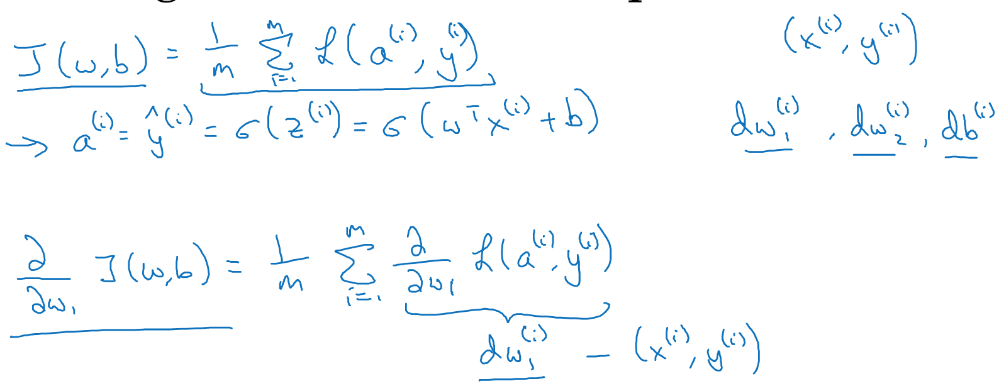
计算过程：
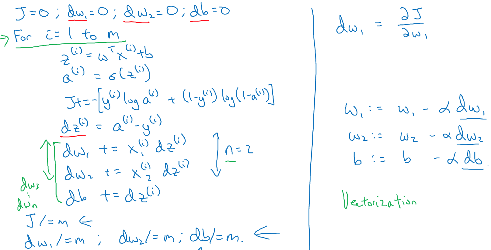

**备注：**
- 计算过程有两次for循环：遍历m个样本、遍历所有的特征w，而使用for循环会较低效率
- 基于向量化(vectorization)来替换for循环（对于深度学习十分重要）

### 2.11、向量化
向量化(vectorization)通常用于消除代码中显示的for循环语句。对于深度学习训练大数据及才能更加优越，因此代码的运行速度十分重要。

**什么是向量化**
对于非向量化计算 Z=wx+b，需要对x每个特征值进行for循环，计算很慢。基于向量化，在python中可以调用 Z=np.dot(w,x)+b。
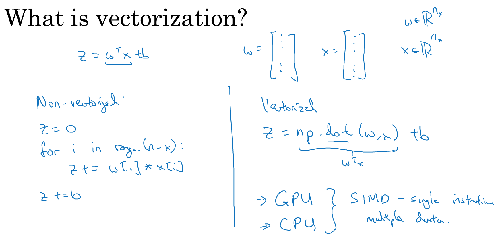

基于Jupyter进行测试：


很多可扩展的深度学习是在GPU(图像处理单元)上运行的，而示例中的Jupyter例子都是运行在CPU。GPU和CPU都有并行化指令(SIMD指令：single instruction multiple data)，指单指令多数据流。如果使用内置函数如使用np.dot，这样的numpy能够充分利用并行化进行计算，而GPU更擅长SIMD计算。

### 2.12、向量化例子
使用内置函数，**避免使用for函数**，能让程序运行速度更加显著。

例子1：
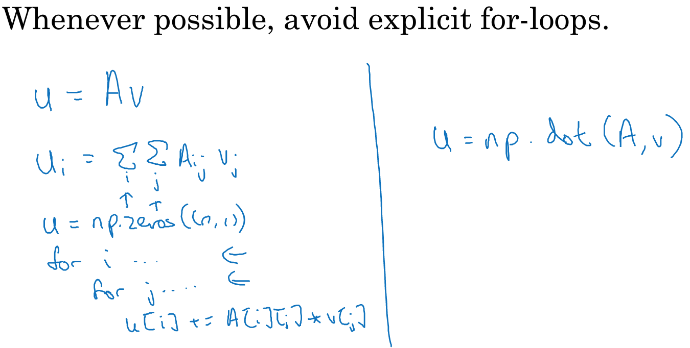

例子2: 对数值执行向量化函数
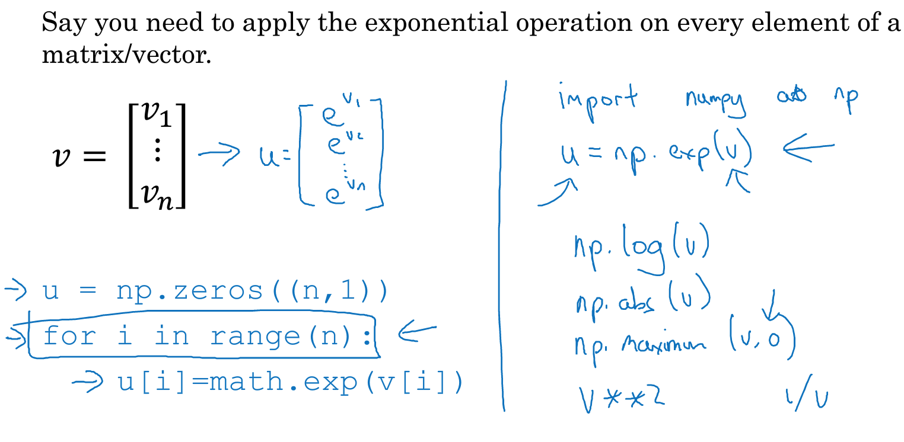

例子3：基于向量化的logistic回归
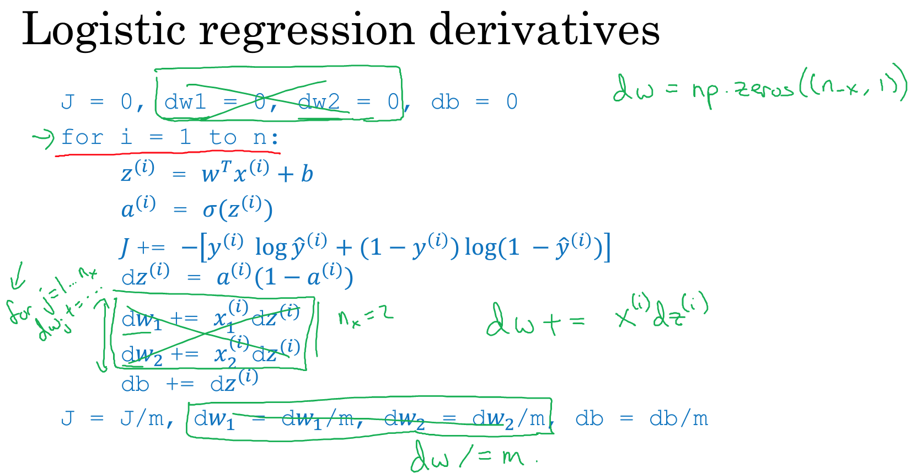
