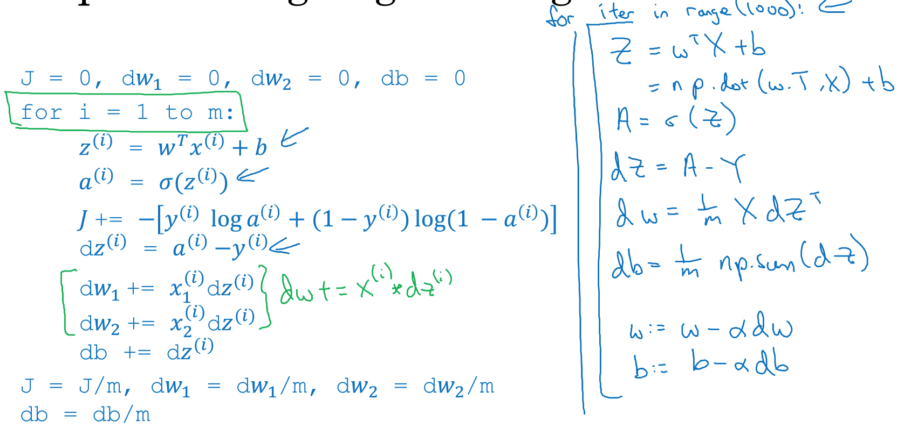

### 2.13、向量化logistic回归
向量化运用于logistic回归，这样能同时处理整个训练集，并实现梯度下降法的迭代。

回顾logistic回顾正向传播，假设有m个训练样本，n个特征向量


技巧：b是(1,1)的自然数，当使用np.dot方法时，python将b扩展为1xm的行向量，在python中成为广播变量。
```
Z = np.dot(W.T, X) + b
A = σ(Z)   #激活函数
```
使用向量化高效计算激活函数，同时输出所有的a。基于向量化进行正向传播计算。

### 2.14、向量化logistic回归的梯度输出
反向传播 -> 梯度计算
使用向量化计算m个训练样本的梯度。


```
dZ = (dz1, dz2,....dzm) = A - Y = (a1-y1,....am-ym)
db = 1/m * np.sum(dZ)
dw = 1/m * XdZ
```

### 2.15、python广播变量
广播(broadcasting)可使Python代码段执行更快的一种技术，以例子讲解Broadcasting。目标：计算四种食物中碳水化合物、蛋白质、脂肪各自的卡路里百分比。


python操作: python -m IPython notebook
```
import numpy as np
A = np.array([[56.0, 0.0, 4.4, 68.0],
              [1.2,104.0,52.0,8.0],
              [1.8,135.0,99.0,0.9]])

cal = A.sum(axis=0)
percentage = A/cal.reshape(1,4)
```

一个3x4的矩阵除以1x4的矩阵，python将矩阵展开，将1x4矩阵转成3x4矩阵。

例子：

结论：


```
(m,n)   算术计算     (1,n)==>(m,n)
(m,n)   算术计算     (m,1)==>(m,n)
```
### 2.16、python numpy说明
numpy提供很高的灵活性既有优势也有劣势，优势：让语言表现力更强，灵活性更大，劣势：会引入细微的BUG。

技巧：尽量不要使用秩为1的数组

改进

如果不确定矩阵的秩，使用如下
```
assert(a.shape == (5, 1))
```


### 2.17、Jupyter使用
官网：http://jupyter.org
mac安装：
```
安装python环境
pip install --user jupyter
python -m IPython notebook # 启动ipython
```
### 2.18、logistic成本函数说明
证明logistic回归的成本函数，其中log函数是单调递增的。最大化p(y|x)的概率就是最小化成本函数。


极大似然法：

