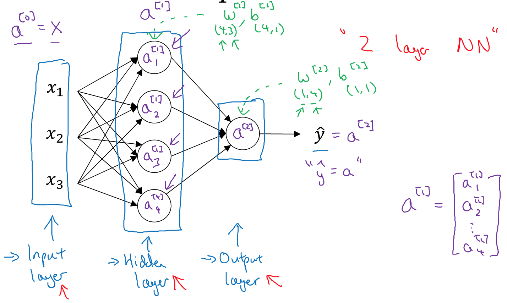
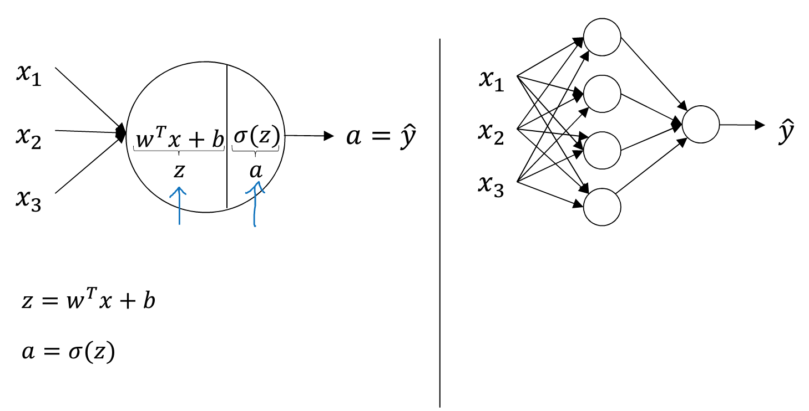
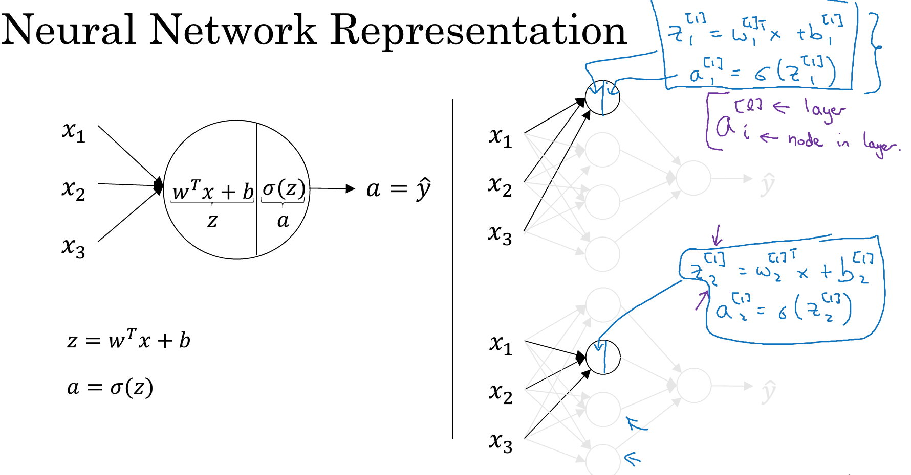
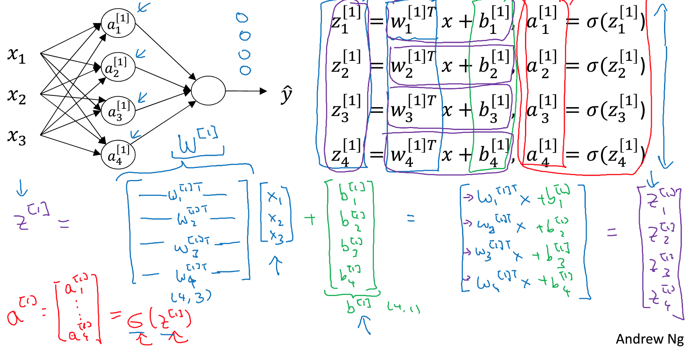
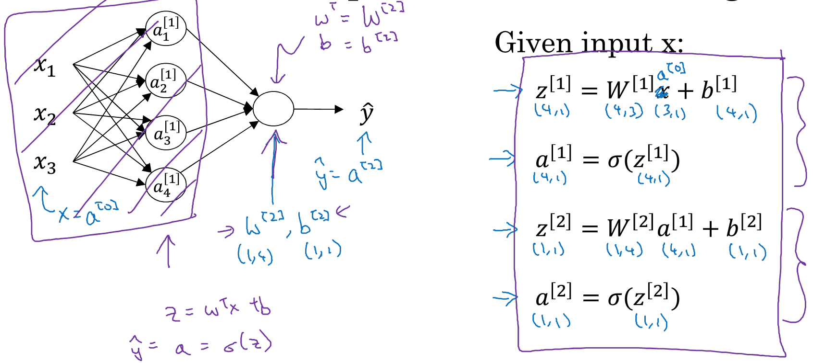
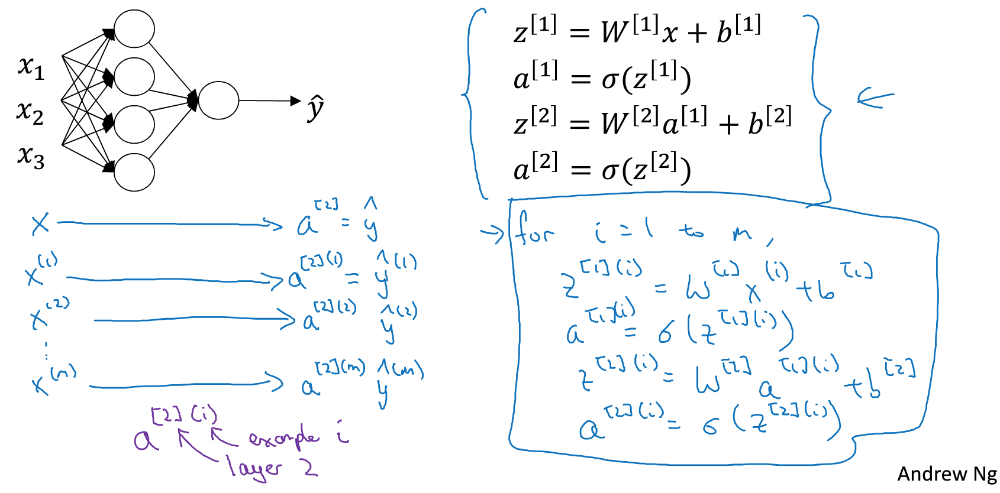
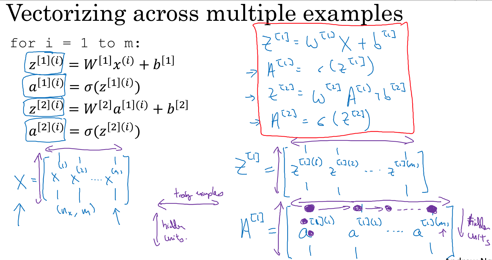

### 3.1、神经网络概览
如何实现神经网络：可以通过**堆叠**很多神经元(如sigmoid函数)构造神经网络。


### 3.2、神经网络表示
浅层神经网络：中间节点->隐藏层；最后单节点—>输出层

隐藏层指：在训练集中，这些中间节点的真正数值是黑盒的。上图是**两层的神经网络**：一层隐藏层和一层输出层。

隐藏层和输出层都是带有参数的，隐藏层参数是W[1]和b[1]，其中W[1]是[4,3]的矩阵，b[1]是[4,1]的矩阵，其中4是隐藏层有四个隐藏单元，3是三个输入特征。输出层有参数W[2],b[2]。其中W[2]是[1,4]矩阵，b[2]是[1,1]矩阵。

### 3.3、计算神经网络的输出

四个隐藏单元分别进行两个步骤：
- 计算Z=Wx+b;
- sigmoid激活函数作用；


得到公式：

推导出每层神经单元的通用公式:
```
Z[i] = W[i]a[i-1] + b[i]
a[i] = σ(Z[i])
```


### 3.4、向量化例子
对3.3总结的四个式子，根据m个样本进行循环。


左上角第一个元素代表：对应第一个训练样本，第一个隐藏单元的激活函数；向下的第二个代表：第一个训练样本的第二个隐藏单元的激活函数。

A矩阵横坐标：对应样本数据；纵坐标：对应隐藏单元
