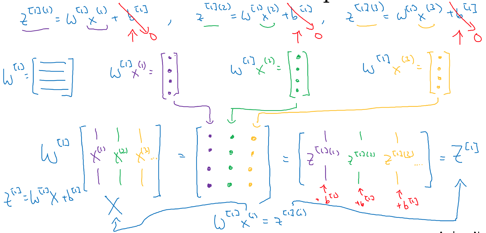
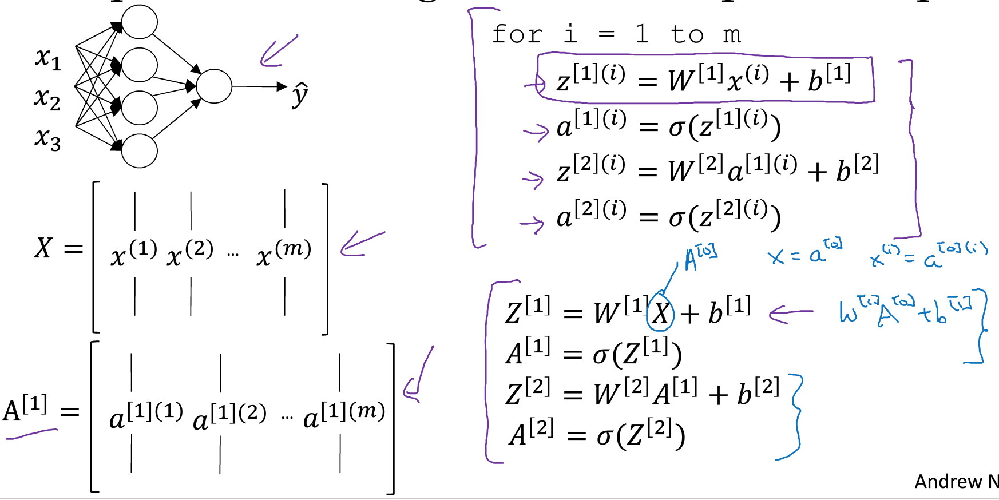
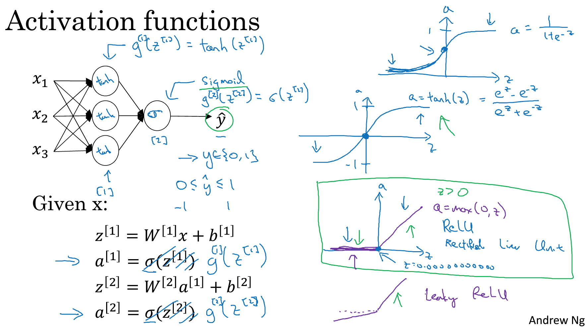
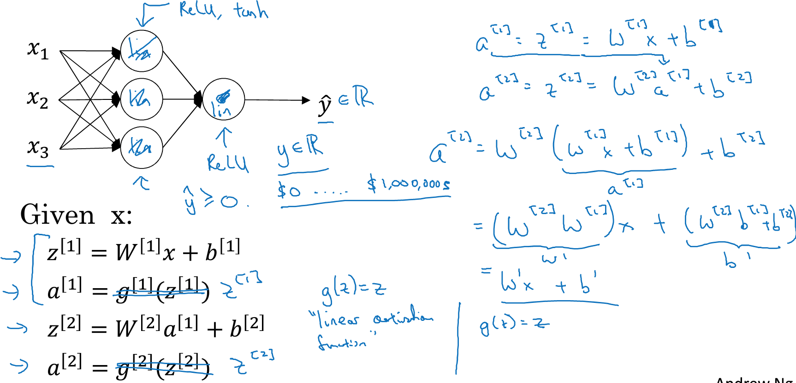
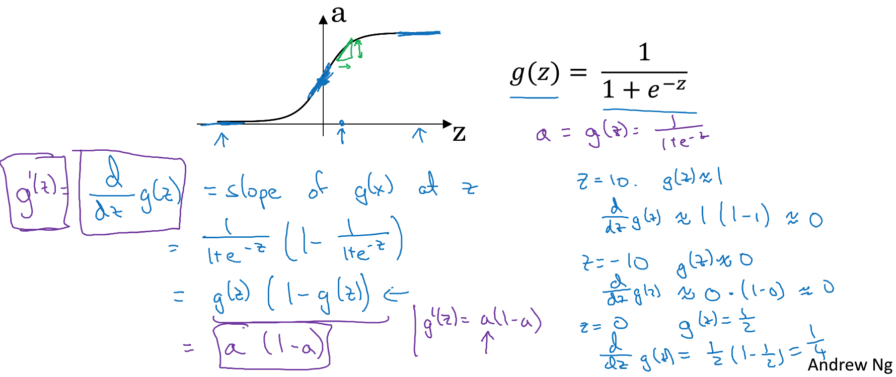
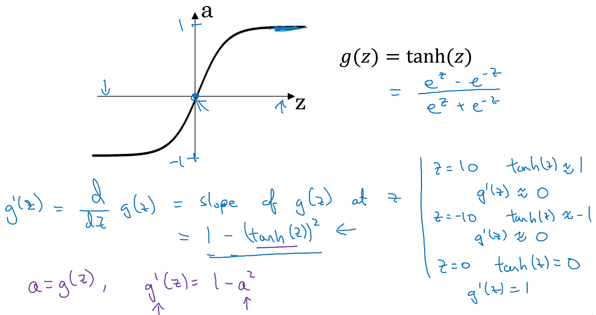
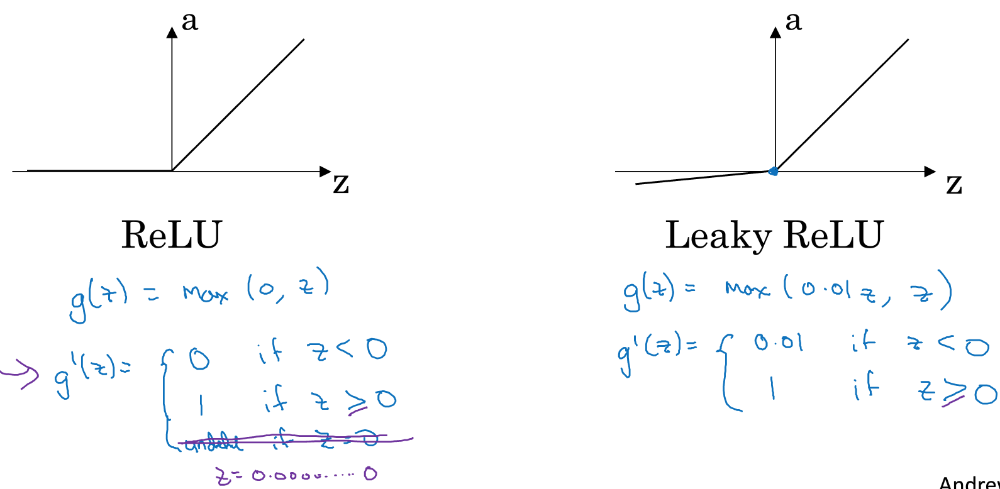

### 3.5、向量化解释
多样本的向量化实现：

使用列向量的堆积实现:

### 3.6、激活函数
神经网络的重要问题：选择输出单元使用的激活函数，目前了解的是σ函数，但是还有其他的函数效果会更好，使用g函数代表。

一般的，使用tanh函数作为激活函数比σ函数(sigmoid函数)更好。因为tanh函数介于(-1,1)之间，激活函数的均值更接近于0，使用tanh作为激活函数有让数据中心化的作用。使用σ函数一般是二分类法。神经网络的每层激活函数都可以不一样。 
tanh函数缺点：如果Z是特别大或者特别小，斜率接近0，降低梯度下降的速度。

**总结**
- 如果是二分类法，输出是0/1，则σ函数适合作为激活函数
- 其他的所有激活函数适合用ReLU(修正线性函数)，神经网络学习速度会很快
- ReLU的缺点是当Z为负数，导数为0，另一个版本：leaky ReLU(带泄露的ReLU)

### 3.7、非线性激活函数
为什么神经网络需要非线性的激活函数，而不是线性激活函数(恒等激活函数)。如果使用线性激活函数，则所有节点的隐藏层，可以用一个线性表达式代替。

可以使用线性激活函数：机器学习中的回归问题，通常是输出层使用，如房价预测，**需求**：房价是非负数。

### 3.8、激活函数的导数
反向传播中需要获取激活函数的导数(斜率)。

双曲正切函数：

ReLU：

