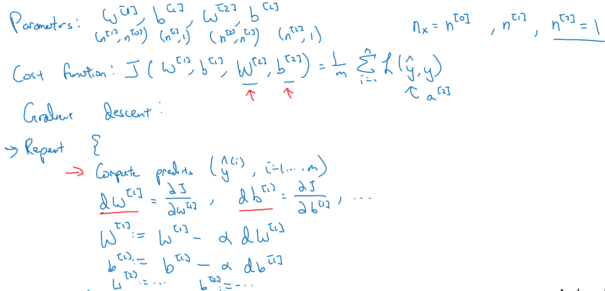
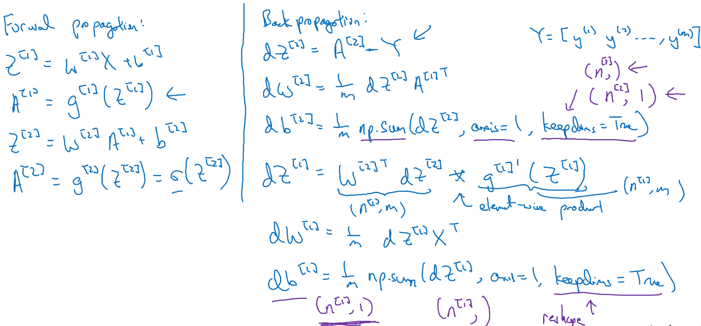
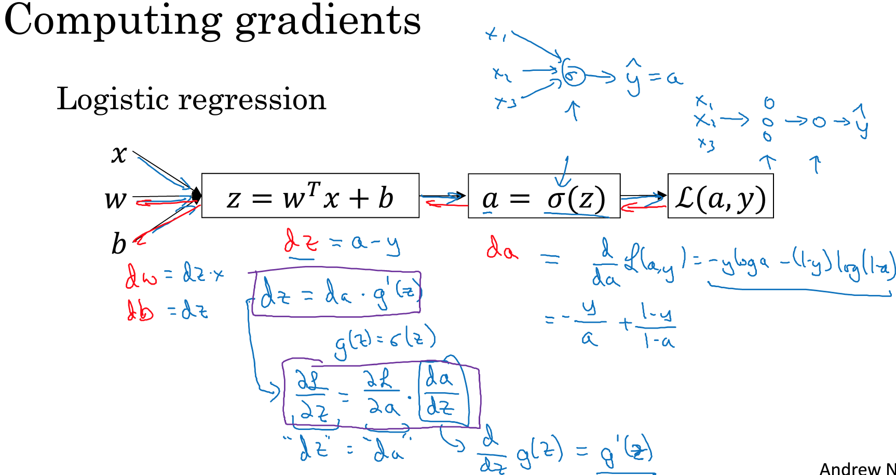
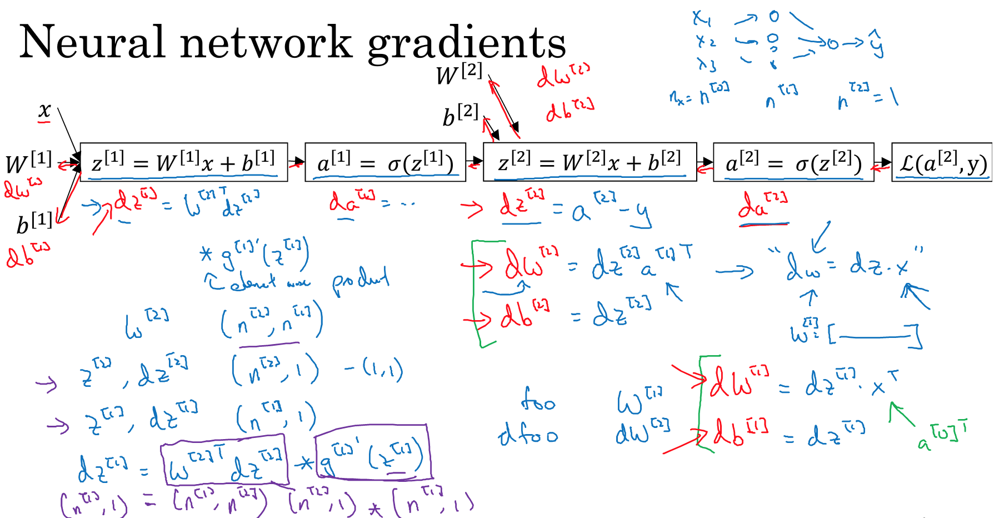
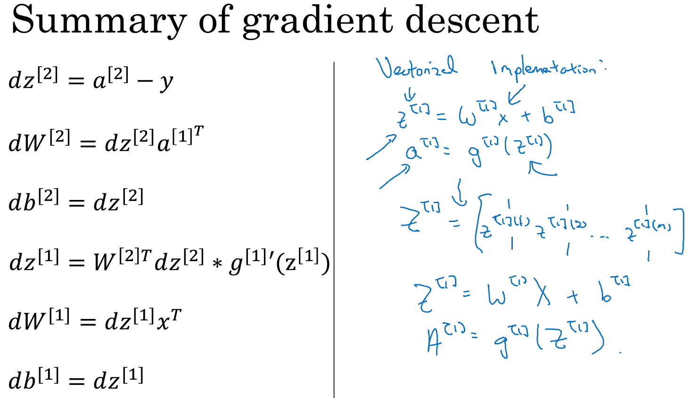
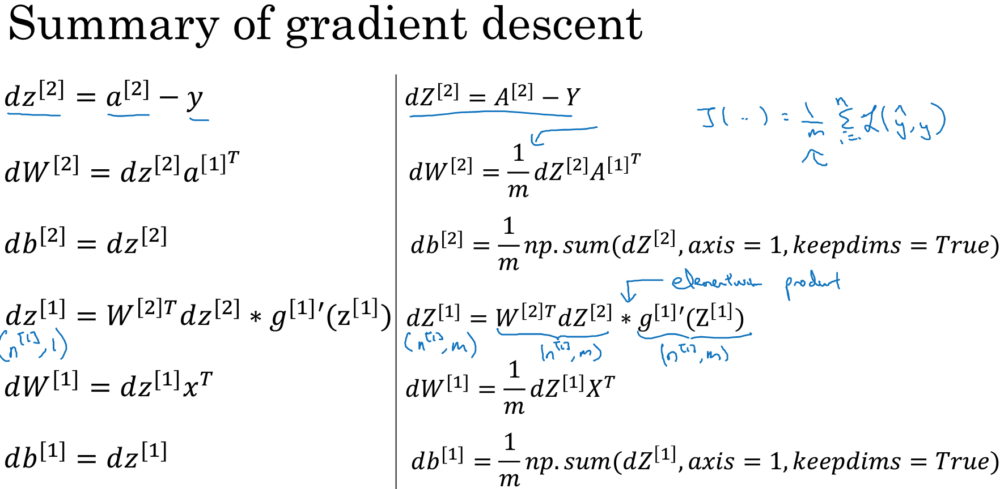
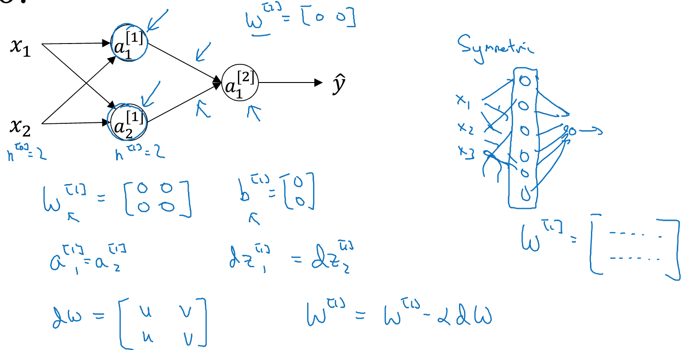
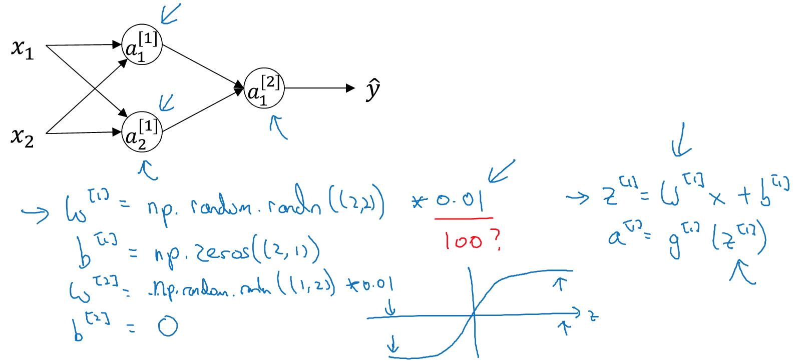

### 3.9、神经网络梯度下降法
学习梯度计算实现反向传播或梯度下降算法

反向传播计算公式：

### 3.10、反向传播
基于梯度下降法来学习神经网络的参数，求导的链式法则

两层神经网络：确保计算的时候维度是匹配的

多样本使用向量化计算：

### 3.11、随机初始化
神经网络训练时，随机初始化十分重要，不能将所有参数都初始化为0。如果初始化都是0，意味着隐藏单元都在做同样的计算。

可以允许b为0，但是w的参数使用小的随机值，如果数值太大，如对于sigmoid函数梯度会变小。因为初始化参数不宜使用过大的值。

