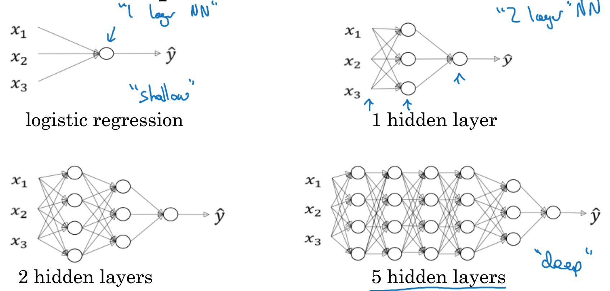
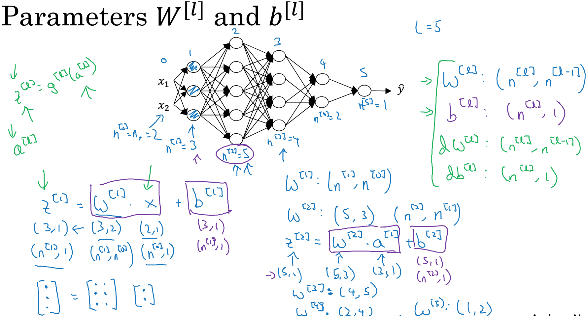
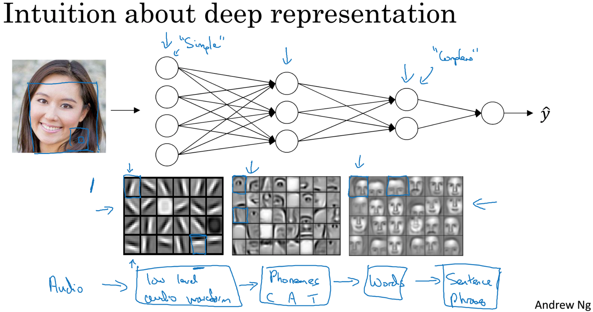

### 4.1、深层神经网络
将之前所学的概念组合起来，构建自己的深层神经网络，之前的logistic回归是浅层神经网络。

在社区发现，只有深层神经网络才具有学习能力，而浅层神经网络不具有学习能力。

深度神经网络符号说明：

- L 代表神经网络的层数
- n^(l) 代表在l层神经网络的隐藏单元

### 4.2、深层神经网络的前向传播
先讨论单个样本的向前传播，之后讨论多个样本的向量化。

对于m个样本，使用向量化，基于单个样本进行同理推导。前向传播基于每个隐藏层的迭代计算的for循环是无法避免的。

### 4.3、校对矩阵维数
避免BUG的有效方法时手动核对一遍算法中矩阵的维数，从单个样本引出m个样本的矩阵结构。<br/>
**单个样本：**

```
W(l)矩阵：(n(l), n(l-1))，dW与W矩阵保持一致
b(l)矩阵：(n(l), 1)，db与b矩阵保持一致
```
**m个样本：**


### 4.4、为什么使用深层表示
例子说明为什么深层神经网络是有效的。使用不同的隐藏单元去识别图形的特征，再使用一层隐藏层去进行脸部组装，再如：语义识别。
 

电路原理和神经网络，减小计算的复杂度：

