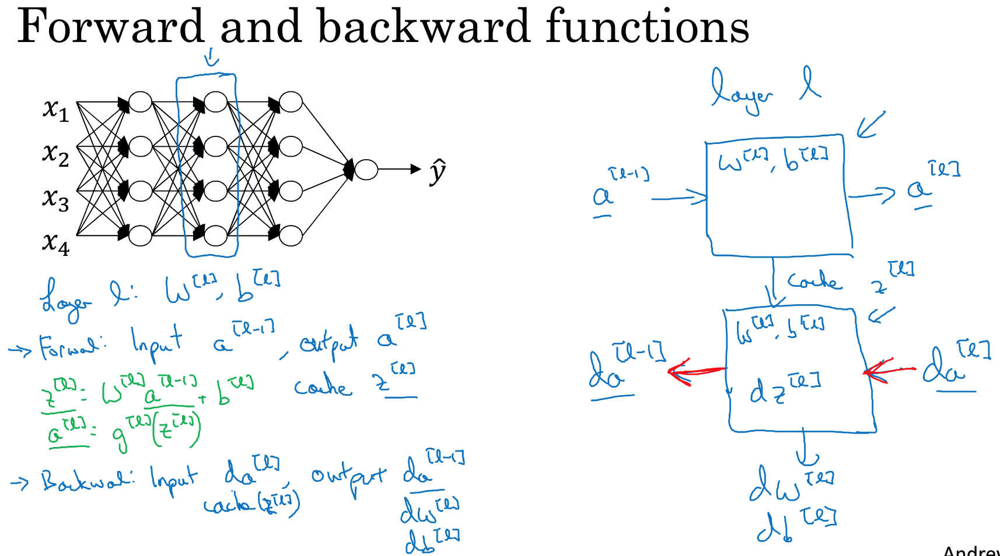
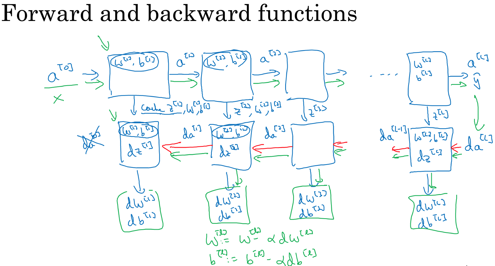
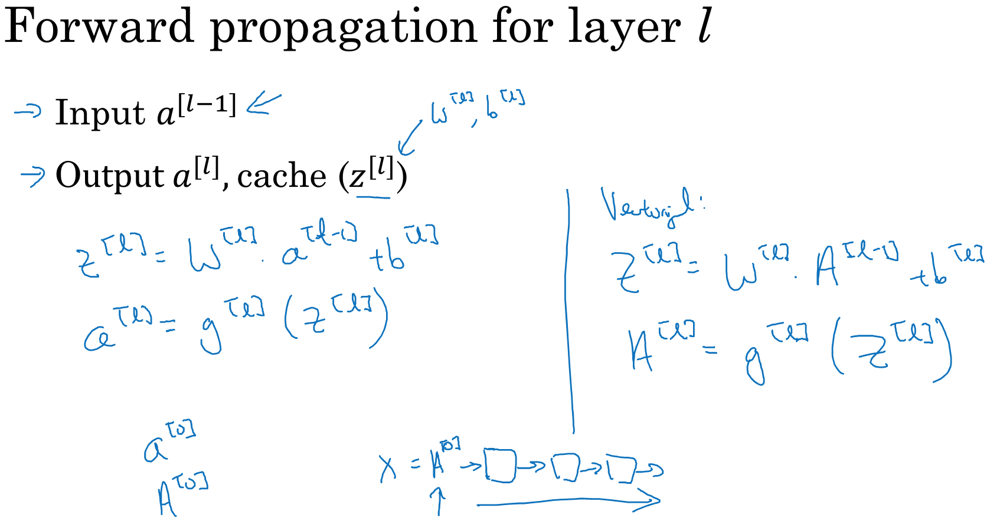
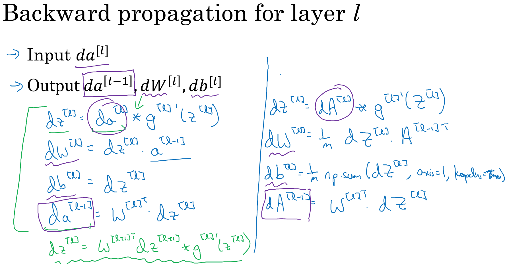
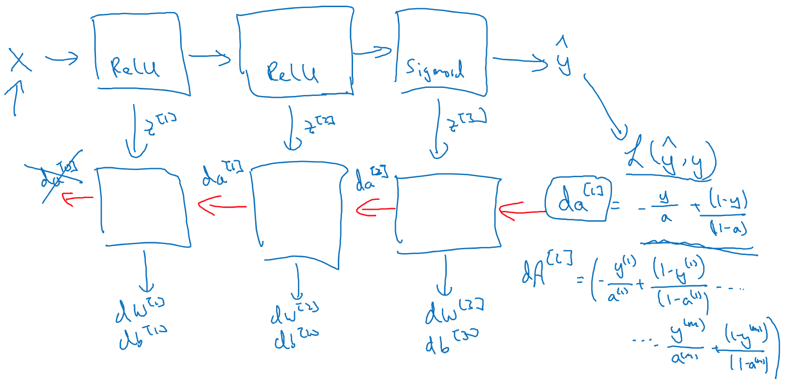
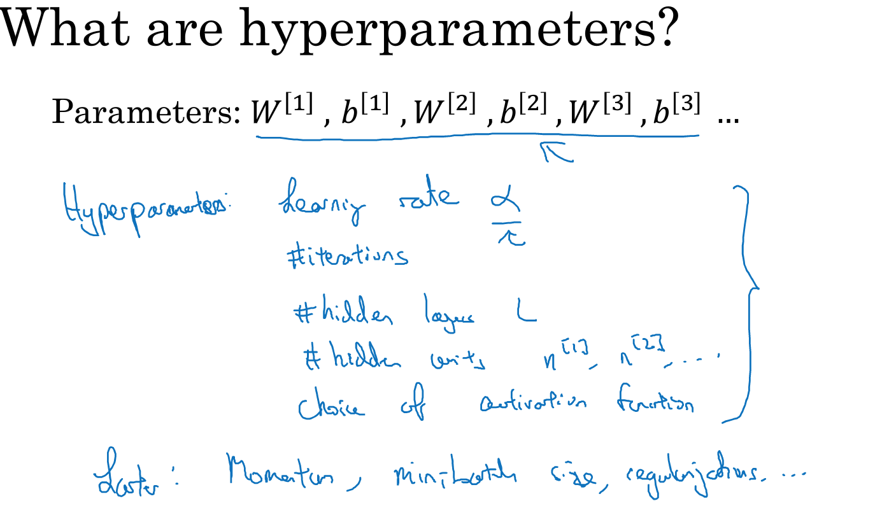
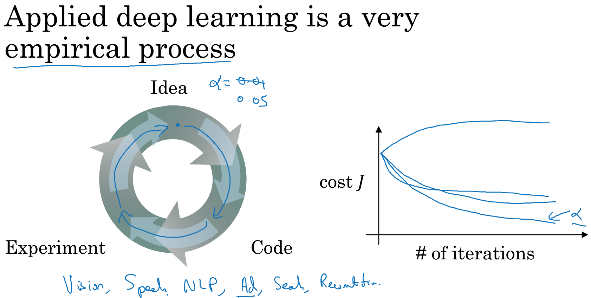
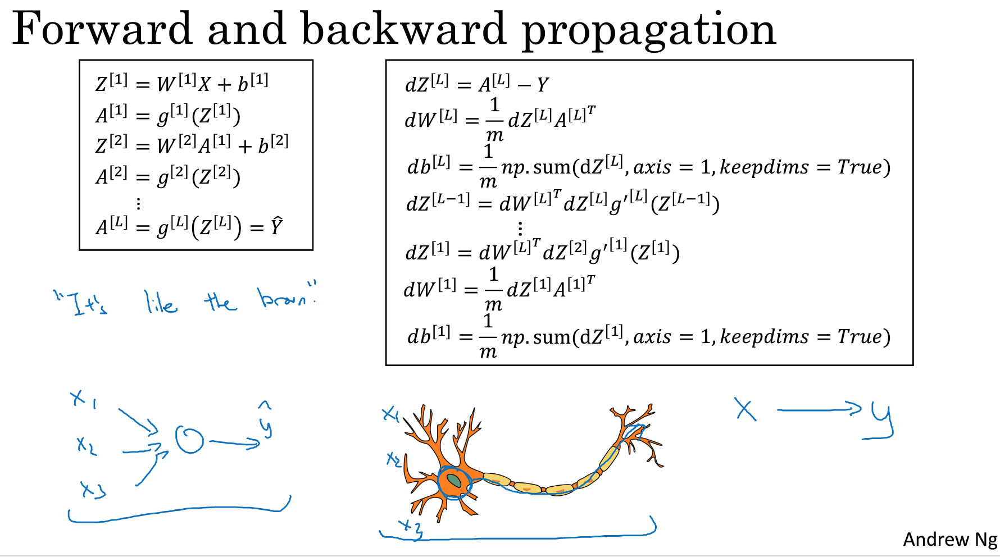

### 4.5、搭建深层神经网络块
针对某个隐藏层进行说明

```
对于第l层，分别有正向传播、反向传播
正向传播：输入a[l-1] ---> W[l],b[l] ---> a[l], 缓存Z[l]
反向传播：输入da[l] ---> W[l],b[l],dZ[l] ---> da[l-1]，输出dW[l],db[l]
```


### 4.6、前向和反向传播
正向传播：

反向传播：

总结：

复杂性大多数来源于数据，而不是代码。
### 4.7、参数和超参数
神经网络运行得好，还需要有完善的参数规划。超参数：定义参数的参数。
超参数：如学习率σ，隐藏层数L，激活函数的选择等，这些超参数决定参数W，b的值。


深度学习是一项精细化的工作,不断尝试不同的超参数：


### 4.8、神经网络与大脑关系
将隐藏节点的激活函数与神经元进行对比，信息在神经元传递。

